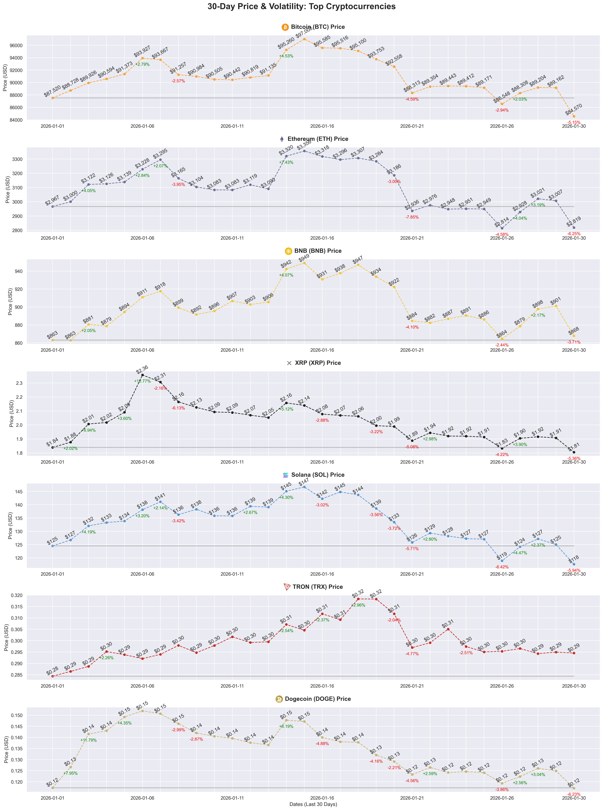
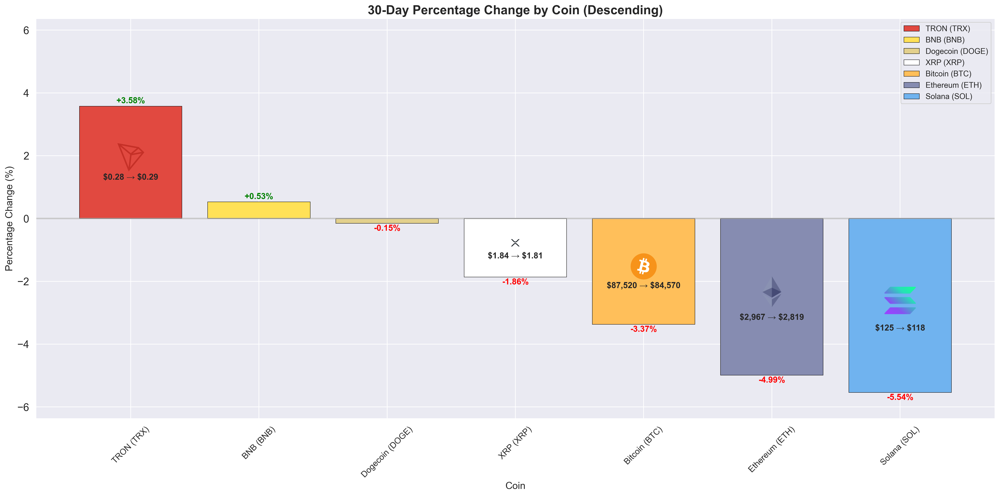

# Crypto Market Analyzer 📊

A comprehensive cryptocurrency analysis tool featuring dynamic data visualization, statistical analysis, and automated insights generation. Built with Python and the CoinGecko API to demonstrate data engineering, analysis, and visualization capabilities.

## 🎯 Project Highlights

**Technical Skills Demonstrated:**
- API integration with error handling and retry logic
- Advanced data manipulation using pandas (groupby, aggregations, merging)
- Statistical analysis (coefficient of variation, correlation analysis)
- Dynamic visualization with matplotlib (subplots, annotations, custom styling)
- Automated insight generation with tiered classification logic
- Brand color extraction from images using PIL and NumPy
- Contrast ratio calculations for accessibility (WCAG standards)

## ✨ Key Features

### 📈 **30-Day Price & Volatility Analysis**
- Automatic stablecoin and derivative filtering (coefficient of variation-based detection)
- Daily closing price tracking (UTC 00:00 snapshots)
- Automated volatility detection with configurable thresholds (±2% default)
- Starting price baseline overlay for performance comparison
- Brand-matched coin colors with automatic contrast adjustment
- Synchronized timelines across all cryptocurrencies for easy comparison

### 📊 **Performance Comparison Dashboard**
- Zero-centered bar chart with symmetric scaling
- Dynamic logo sizing based on performance magnitude
- Integrated price change annotations (start → end)

### 💡 **Automated Market Insights**
- **Market Overview**: Sentiment analysis (bullish/bearish/mixed) based on overall returns
- **Coin-by-Coin Analysis**: Nuanced characterization combining volatility and returns
  - Distinguishes between "stable gains" vs "turbulent gains"
  - Classifies based on median volatility and significance thresholds
- **Key Observations**: 
  - Volatility-return correlation analysis
  - Performance spread quantification with tiered interpretation
  - Risk-adjusted return comparisons

## 🚀 Getting Started

### Prerequisites

- Python 3.8+
- Jupyter Notebook or JupyterLab

### Installation
```bash
# Clone the repository
git clone https://github.com/oganbayril/crypto-market-analyzer.git
cd crypto-market-analyzer

# Install dependencies
pip install -r requirements.txt

# Launch Jupyter
jupyter notebook
```

### Usage

1. Open `crypto_market_analyzer.ipynb`
2. Run all cells sequentially
3. Customize parameters in the **User Configuration** section:
   - `top_n_coins_input`: Number of coins to analyze (default: 10, max: 15)
   - `volatility_threshold`: Percentage threshold for volatility detection (default: 2%)

## 📊 Sample Output

**Market Cap Overview**
```
Top 10 cryptocurrencies by market cap as of 2026-01-30:

1: Bitcoin (BTC)
   Market Cap: $1,790,986,003,131
   Current Price: $89,637.65
...
```

**Volatility Analysis**
```
📊 Volatility Analysis:

- Most volatile: XRP (XRP) (10 days with ±2%+ swings)
- Most stable: BNB (BNB) (6 days volatile)

- Largest single drop: Ethereum (ETH) (-4.66%)
- Largest single increase: XRP (XRP) (+12.77%)
```

**Market Insights**
```
💡 Market Insights & Summary

📊 Market Overview: Bullish 30-day period with all analyzed coins posting gains.

🎯 Coin-by-Coin Analysis:
- BNB (BNB): Gained +5.46% with 5 volatile days - stable upward movement
- XRP (XRP): Gained +3.69% with 13 volatile days - volatile but modest net gain
...
```

### Sample Visualizations

**30-Day Price & Volatility Analysis**


**Performance Comparison**


*Sample output generated by running the analysis script.*

## 🛠️ Technical Architecture

**Data Pipeline:**
1. **Fetch** → CoinGecko API (top coins by market cap)
2. **Filter** → Automatic stablecoin/derivative removal (CV < 0.01)
3. **Enrich** → Logo extraction, dominant color calculation, contrast adjustment
4. **Analyze** → Statistical calculations (volatility, returns, correlations)
5. **Visualize** → Multi-subplot graphs with brand-matched styling
6. **Synthesize** → Automated insight generation with tiered classifications

**Key Libraries:**
- `requests` - API integration with retry logic
- `pandas` - Data manipulation and aggregation
- `matplotlib` - Visualization with custom annotations
- `seaborn` - Statistical plotting
- `PIL` / `numpy` - Image processing and color extraction

## 📂 Project Structure
```
crypto-market-analyzer/
├── crypto_market_analyzer.ipynb    # Main analysis notebook
├── coin_logos/                     # Cached coin logos (auto-generated)
├── requirements.txt                # Python dependencies
└── README.md                       # Documentation
```

## 🔍 Advanced Features

- **Intelligent Color Handling**: Extracts dominant colors from coin logos and automatically adjusts for WCAG contrast compliance
- **Error Resilience**: Retry logic with exponential backoff for API rate limits
- **Dynamic Scaling**: All thresholds and classifications adapt to the analyzed dataset
- **Performance Optimization**: Logo caching to minimize redundant API calls

## 📈 Future Enhancements

- [ ] Historical comparison across multiple time periods
- [ ] Correlation matrix heatmap between cryptocurrencies
- [ ] Moving average overlays (7-day, 30-day)
- [ ] Export functionality (PDF reports, CSV data)
- [ ] Interactive Plotly dashboards

## ⚠️ Disclaimer

This tool is for **educational and demonstration purposes only**. It showcases data analysis and visualization techniques and should not be used as the sole basis for investment decisions.

## 📧 Contact

**Ogan Bayril**  
[GitHub](https://github.com/oganbayril)

---

*Built to demonstrate proficiency in Python data analysis, API integration, and automated insight generation.*